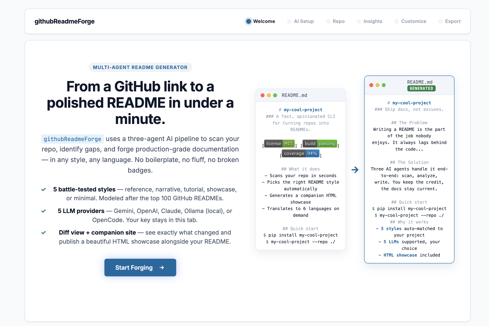
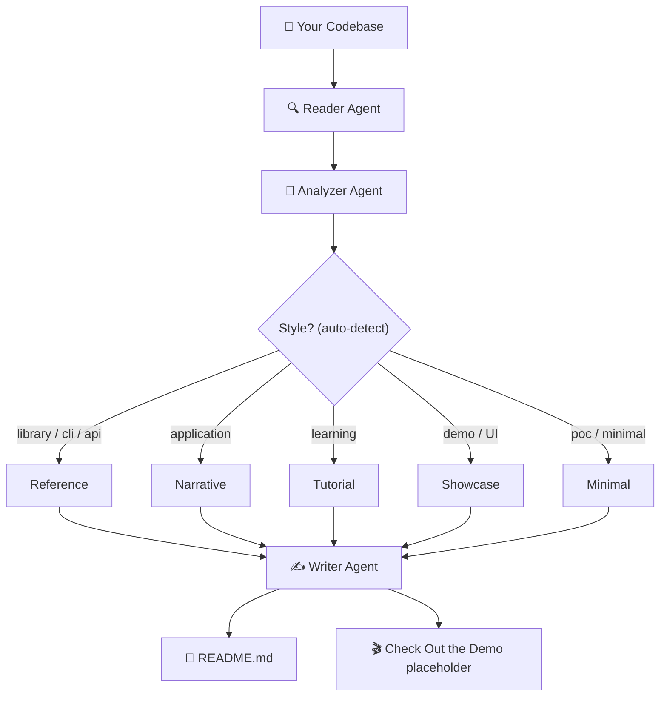

<div align="center">

# githubReadmeForge ⚒️

### From a GitHub link to a polished README in under a minute.

**Three AI agents. Five battle-tested styles. Five LLM providers. Zero boilerplate.**

[](https://python.org)
[](LICENSE)
[](#-supported-llm-providers)
[](#-five-styles-modeled-after-top-github-readmes)

</div>

---

## 🎬 See It In Action

> ```html
> <p align="center">
>   
> </p>
>
> <p align="center">
>   <a href="assets/demo.mp4"></a>
> </p>
> ```


---

## The Problem

Every developer has been there. You build something great — a CLI tool, a library, a full-stack app — and then comes the part nobody enjoys: **writing the README**.

So you skip it. Or you write three bullet points and call it a day. And then:

- New contributors open the repo, see a barren README, and leave
- Your future self comes back 6 months later and has no idea how the project works
- The README you *did* write is now outdated because the codebase evolved

The result: **great code that nobody uses because nobody understands it.**

A good README requires understanding architecture, extracting the right code examples, drawing diagrams, documenting configuration — hours of work that feels disconnected from actual development.

## The Solution

**githubReadmeForge** reads your codebase and writes the README for you.

Not a template. Not a form. It actually scans your files, maps your architecture, identifies your tech stack, extracts configuration variables, and generates a complete, narrative-driven README &mdash; in the *style that fits your project* and in *any of six languages*.

It works through a **three-agent AI pipeline**:

1. **🔍 Reader Agent** scans your codebase &mdash; tree, configs, entry points, docstrings, hero images, external APIs
2. **🧠 Analyzer Agent** uses an LLM to extract meaning &mdash; tech stack, features, architecture connections, *concrete differentiators*, improvement opportunities
3. **✍️ Writer Agent** uses the analysis to forge a polished, structured README with diagrams, tables, real code examples, and a "Check Out the Demo" placeholder reserved for your screenshots

You can run it as a **CLI command** or through a **web dashboard** with a 6-step wizard. Bring your own LLM key or use OpenCode for a fully local flow.

---

## 🎨 Five Styles, Modeled After Top GitHub READMEs

Every top-rated GitHub README follows one of five patterns. The Writer picks the right one automatically based on your project type, and you can override in the dashboard.

| Style | Best for | Real-world model |
|---|---|---|
| **Reference** | Libraries, CLIs, SDKs, APIs &mdash; user-manual style, exhaustive API docs | Axios, ripgrep, FastAPI, gh CLI |
| **Narrative** | Products, frameworks, applications &mdash; story-driven problem → solution flow | Supabase, AppFlowy, Plausible |
| **Tutorial** | Learning resources, awesome-lists, teaching repos &mdash; learning path first | build-your-own-x, freeCodeCamp |
| **Showcase** | UI products with a strong visual interface &mdash; hero image + feature grid | AppFlowy, Phaser, httpie |
| **Minimal** | Small utilities, single-file scripts &mdash; 60-line trailer that defers to docs | jq, Three.js, tldr |

Auto-detected default by project type: `library/cli/api` → Reference, `application` → Narrative, `learning` → Tutorial, `demo` → Showcase, `poc/minimal` → Minimal.

---

## How It Works



### Agent Roles

| Agent | Responsibility | Input | Output |
|---|---|---|---|
| **🔍 Reader** | Scans files, extracts tree, configs, source, hero images, external API calls, version info | Repository path or Git URL | `scan_results` (tree, configs, code context, hero_assets) |
| **🧠 Analyzer** | Identifies tech stack, features, architecture flow, *differentiators*, gaps, recommended style | `scan_results` | Structured JSON analysis |
| **✍️ Writer** | Generates README in auto-selected style with diagrams, tables, real code, demo placeholder | `scan_results` + `analysis` | `README.md` |

---

## Features

### 🤖 Five LLM Providers
Bring your own AI. Switch between **Google Gemini**, **OpenAI**, **Anthropic Claude**, **Ollama** (fully local), or **OpenCode** (your local coding agent as a backend). Your API key stays in your browser tab and is never sent to any server.

### 🎨 Five Battle-Tested README Styles
Auto-detected from your project type. Modeled after the top 100 GitHub READMEs. Override anytime in the dashboard. See [the table above](#-five-styles-modeled-after-top-github-readmes).

### 📊 Diagnostic Dashboard with Gap-to-Score Sync
Every point deducted from the Docs Health Score is shown as a row in the Identified Gaps table &mdash; you see *exactly* why the score is what it is. Includes a "X gaps found" pill that scrolls directly to the table.

### 🎬 Smart Demo Placeholder
For visual projects without real screenshots, the README reserves a `🎬 Check Out the Demo` section with copy-pasteable instructions for the project owner to drop in screenshots, GIFs, or a video link.

### 🖼️ Auto-Detected Hero Assets
The Reader Agent scans `assets/`, `docs/`, `screenshots/`, `public/`, and more &mdash; prioritizing files named `hero`, `screenshot`, `demo`, `feature`. The Writer uses them in the generated README.

### 🔄 Side-by-Side Diff View
Preview tab → Compare tab shows the original vs generated README side-by-side, with a "X sections added" stat and word count diff.

### 🌐 Web Dashboard with 6-Step Wizard
Welcome → **AI Setup** → **Repo** → **Insights** → **Customize** → **Export**. Real-time progress, auto-detected style, downloadable outputs.

### 🌍 Internationalization (i18n)
Generate READMEs in English, Simplified Chinese, Spanish, Japanese, German, or French. The AI translates all narrative content while preserving code, commands, and file names.

### 🛡️ Guardrails & Safety
Built-in safety checks prevent the AI from being hijacked for off-topic tasks. The system strictly enforces README-only generation &mdash; both server-side and in the LLM prompt.

### 💻 CLI & Instant Mode
Interactive mode walks you through customization questions. Instant mode (`--instant`) generates everything in one shot.

### 🐳 Docker-Ready
A `Dockerfile` and `docker-compose.yml` ship in the repo for fully reproducible runs.

---

## Quick Start

### Installation

```bash
# Clone the repository
git clone https://github.com/your-username/githubReadmeForge.git
cd githubReadmeForge

# Create a virtual environment
python3 -m venv venv
source venv/bin/activate

# Install dependencies
pip install -r requirements.txt
```

Or with Docker:

```bash
docker-compose up
```

### CLI Usage

```bash
# Generate README for the current directory (instant mode, requires a provider key)
export GEMINI_API_KEY="your-key"
python main.py --path . --instant

# Generate with OpenAI
export OPENAI_API_KEY="your-key"
python main.py --path . --provider openai

# Use Ollama fully offline (no key needed)
ollama serve &
python main.py --path . --provider ollama

# Generate for a remote GitHub repo
python main.py --path https://github.com/user/repo.git --instant

# Interactive mode with translation
python main.py --path ./my-project --lang zh-CN

# Force a specific style (overrides auto-detection)
python main.py --path . --style tutorial
```

### Web Dashboard

```bash
# Start the web server
python server.py --port 8082

# Open http://localhost:8082 in your browser
```

The dashboard walks you through 6 steps: pick an AI provider, paste a GitHub URL or local path, watch the agents analyze, customize the brief, then preview, compare, and download.

---

## Configuration

### Environment Variables

| Variable | Description | Required | Default |
|---|---|---|---|
| `GEMINI_API_KEY` | Google Gemini API key | No* | &mdash; |
| `OPENAI_API_KEY` | OpenAI API key | No* | &mdash; |
| `ANTHROPIC_API_KEY` | Anthropic Claude API key | No* | &mdash; |
| `OLLAMA_HOST` | Ollama server URL | No | `http://localhost:11434` |
| `OPENCODE_HOST` | OpenCode server URL | No | `http://127.0.0.1:4096` |
| `README_FORGE_PROVIDER` | Force a specific LLM provider | No | Auto-detect |
| `README_FORGE_MODEL` | Override the default model for the selected provider | No | Provider default |

> \* At least one LLM provider must be configured. The server returns a clear error if none is reachable.

### CLI Flags

| Flag | Short | Description | Default |
|---|---|---|---|
| `--path` | `-p` | Repository path or Git URL | `.` |
| `--provider` | &mdash; | `gemini`, `openai`, `claude`, `ollama`, `opencode` | Auto-detect from env vars |
| `--model` | &mdash; | Model name override | Provider default |
| `--style` | &mdash; | `reference`, `narrative`, `tutorial`, `showcase`, `minimal` | Auto-detect from project type |
| `--lang` | `-l` | Target language code (`en`, `zh-CN`, `es`, `ja`, `de`, `fr`) | `en` |
| `--instant` | `-i` | Skip interactive questions | `false` |
| `--preview` | `-v` | Preview existing generated files | `false` |
| `--port` | &mdash; | Port for preview / showroom server | `8080` |

---

## API Reference

The web dashboard is backed by a small HTTP API. You can use it directly to integrate the pipeline into your own tools.

### `POST /api/analyze`

Scans a codebase and returns structural analysis.

**Request:**
```json
{
  "path": "./my-project",
  "provider": "gemini",
  "model": "gemini-1.5-flash",
  "api_key": "optional-override"
}
```

**Response:**
```json
{
  "success": true,
  "score": 65,
  "score_gaps": [
    { "id": "1", "title": "Missing visual elements", "description": "...", "type": "Visual" }
  ],
  "scan": { "path": "...", "tree": "...", "hero_assets": [...] },
  "analysis": {
    "project_type": "library",
    "recommended_style": "reference",
    "tech_stack": ["Python", "Flask"],
    "differentiators": ["Zero runtime dependencies"],
    "key_features": [...]
  }
}
```

### `POST /api/generate`

Generates a polished README from the scan + analysis.

**Request:**
```json
{
  "scan": { "..." },
  "analysis": { "..." },
  "provider": "gemini",
  "style": "narrative",
  "lang": "en"
}
```

**Response:**
```json
{
  "success": true,
  "readme": "# Project Name\n...",
  "draft_id": ".readme_forge_draft_a1b2c3d4"
}
```

### `POST /api/drift`

Detects documentation drift &mdash; whether the README mentions all the commands, env vars, and components that exist in the code.

### `POST /api/models`

Lists available models for a provider (used by the "Load models" button in the dashboard).

---

## How `recommended_style` is Chosen

The Analyzer inspects deterministic signals (package manifests, CLI frameworks, web frameworks, docstrings) and the LLM classifies the project. The style is then picked by project type:

| Project type | Default style | Why |
|---|---|---|
| `library`, `cli`, `api` | `reference` | These projects have a public surface area &mdash; users need a manual, not a story. |
| `application` | `narrative` | Apps compete for mindshare; the Problem → Solution arc wins. |
| `learning`, `tutorial` | `tutorial` | The README *is* the learning path. |
| `demo` | `showcase` | The product's value is visual; lead with a hero image. |
| `poc`, `minimal` | `minimal` | Small projects shouldn't pad with 5 sections. |

You can always override this in the dashboard's "README Style" dropdown.

---

## Repository Structure

```
githubReadmeForge/
├── main.py                          # CLI entry point
├── server.py                        # Web API server (6-step wizard)
├── pyproject.toml                   # Project metadata & dependencies
├── requirements.txt                 # Python dependencies
├── Dockerfile                       # Container build
├── docker-compose.yml               # One-command stack
├── LICENSE                          # MIT
├── README.md                        # ← you are here
├── CONTRIBUTING.md                  # Contribution guidelines
├── readme_forge/                    # Core Python package
│   ├── cli.py                       # CLI argument parsing
│   ├── llm.py                       # Multi-provider LLM client (Gemini, OpenAI, Claude, Ollama, OpenCode)
│   ├── preview.py                   # Terminal preview & local server
│   ├── visual_assets.py             # Adaptive SVG hero banner generator
│   ├── hero_generator.py            # (legacy) hero SVG generation
│   └── agents/
│       ├── reader.py                # Codebase scanner (tree, configs, code, hero_assets, external_apis)
│       ├── analyzer.py              # LLM-driven structural analysis
│       ├── writer.py                # README generator (5 styles, demo placeholder, anti-pattern guardrails)
│       ├── contracts.py             # Deterministic project classification & style mapping
│       └── orchestrator.py          # Pipeline coordinator
├── web/                             # Web dashboard
│   ├── index.html                   # 6-step wizard markup
│   ├── app.js                       # Frontend logic
│   ├── styles.css                   # All styles (~2000 lines)
│   └── favicon.svg                  # Document-with-code-lines icon
├── tests/                           # Pytest suite
│   ├── test_agent_contracts.py
│   ├── test_analyzer_fallback.py
│   ├── test_reader.py
│   ├── test_visual_assets.py
│   ├── test_writer_robustness.py
│   ├── test_demo_placeholder.py     # Demo placeholder section tests
│   └── ...
├── assets/                          # ← drop your demo.gif & screenshot.png here
│   └── readme/
│       ├── brand-light.svg          # Light-mode hero banner
│       ├── brand-dark.svg           # Dark-mode hero banner
│       └── architecture.svg         # Architecture diagram asset
└── .agents/                         # AI assistant config
    ├── AGENTS.md
    └── skills/
        ├── add-llm-provider/
        └── improve-generation-prompt/
```

---

## Contributing

Contributions are welcome! See [CONTRIBUTING.md](CONTRIBUTING.md) for setup instructions, the dev workflow, and PR guidelines.

If you're adding a new LLM provider, see the [`.agents/skills/add-llm-provider/`](.agents/skills/add-llm-provider/) skill &mdash; it's a step-by-step guide.

If you're tuning the writer prompts, see the [`.agents/skills/improve-generation-prompt/`](.agents/skills/improve-generation-prompt/) skill &mdash; it documents the data pipeline and the right places to change.

## License

This project is licensed under the MIT License &mdash; see the [LICENSE](LICENSE) file for details.

---

<div align="center">

**Built with ⚒️ by developers who got tired of writing READMEs by hand.**

[⬆ back to top](#githubreadmeforege-%EF%B8%8F)

</div>
