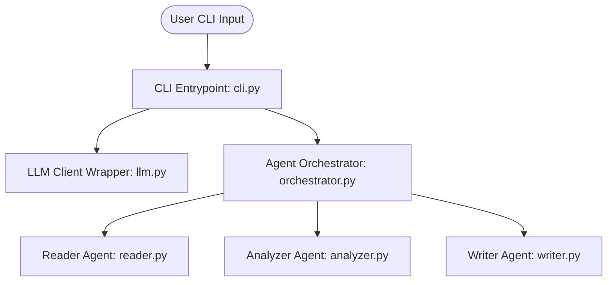

<picture>
  <source media="(prefers-color-scheme: dark)" srcset="assets/readme/hero-dark.svg">
  <source media="(prefers-color-scheme: light)" srcset="assets/readme/hero-light.svg">
  
</picture>

<p align="right">
  <strong>English</strong> · <a href="README.zh-CN.md">简体中文</a>
</p>

# 🛠️ githubReadmeForge

A terminal-based CLI tool that uses a multi-agent orchestration framework to analyze codebases and forge consistent, visually structured, and example-rich `README.md` files.

---

## 🎯 What & Why

Stop struggling with writing and keeping codebase documentation up to date. `githubReadmeForge` reads your code, maps architecture flow connections, highlights improvements, and generates an engaging README along with an interactive HTML showroom website.

---

## 🚀 Quick Start / Usage

### Installation

```bash
git clone https://github.com/user/githubReadmeForge.git
cd githubReadmeForge
pip install -r requirements.txt
```

### Usage

Run the tool in interactive mode on your repository:
```bash
python main.py --path .
```

For instant mode without questions:
```bash
python main.py --path . --instant
```

---

## 🏗️ System Architecture



---

## 📂 Repository Structure

```
githubReadmeForge/
├── main.py
├── readme_forge/
│   ├── agents/
│   │   ├── analyzer.py
│   │   ├── orchestrator.py
│   │   ├── reader.py
│   │   └── writer.py
│   ├── cli.py
│   ├── hero_generator.py
│   └── llm.py
├── requirements.txt
├── server.py
└── web/
    ├── index.html
    ├── styles.css
    └── app.js
```

---

## ⚙️ Configuration

<details>
<summary><b>API Credentials Setup</b></summary>

Set up environment variables for your chosen LLM provider:

```bash
# For Gemini (Default)
export GEMINI_API_KEY="your-gemini-key"

# For OpenAI
export OPENAI_API_KEY="your-openai-key"

# For Anthropic Claude
export ANTHROPIC_API_KEY="your-claude-key"

# For local Ollama
export README_FORGE_PROVIDER="ollama"
export OLLAMA_HOST="http://localhost:11434"
```
</details>

---

## 🤝 Contributing & License

Contributions are welcome! Please feel free to submit a Pull Request.

This project is licensed under the MIT License - see the [LICENSE](LICENSE) file for details.
