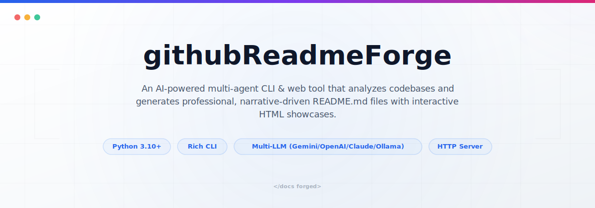
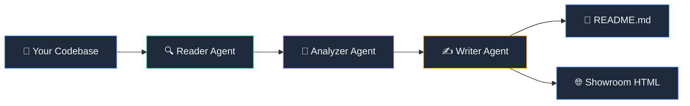

<picture>
  <source media="(prefers-color-scheme: dark)" srcset="assets/readme/hero-dark.svg">
  <source media="(prefers-color-scheme: light)" srcset="assets/readme/hero-light.svg">
  
</picture>

<div align="center">

# githubReadmeForge ⚒️

### AI-Powered README Generation for Any Codebase

**Codebase → README. Three AI agents. One command.**

[](https://python.org)
[](LICENSE)
[](https://ai.google.dev)

</div>

---

## The Problem

Every developer has been there. You build something great — a CLI tool, a library, a full-stack app — and then comes the part nobody wants to do: **write the README**.

So you skip it. Or you write three bullet points and call it a day. And then:

- New contributors open the repo, see a barren README, and leave
- Your future self comes back 6 months later and has no idea how the project works
- The README you *did* write is now outdated because the codebase evolved

The result? **Great code that nobody uses because nobody understands it.**

Writing a good README requires understanding architecture, extracting the right code examples, creating diagrams, documenting configuration — it's hours of work that feels disconnected from actual development.

## The Solution

**githubReadmeForge** reads your codebase and writes the README for you.

Not a template. Not a form you fill out. It actually scans your files, maps your architecture, identifies your tech stack, extracts configuration variables, and generates a complete, narrative-driven README — plus an interactive HTML showcase site.

It works through a **three-agent AI pipeline**:

1. **Reader Agent** scans your codebase — tree structure, config files, entry points, docstrings
2. **Analyzer Agent** uses an LLM to extract meaning — tech stack, features, architecture connections, improvement opportunities
3. **Writer Agent** uses the analysis to forge a polished, structured README with diagrams, tables, and real examples

You can run it as a **CLI command** or through a **web dashboard**. Works with Gemini, OpenAI, Claude, Ollama, or completely offline with the mock generator.

---

## How It Works



### Agent Roles

| Agent | Responsibility | Input | Output |
|-------|---------------|-------|--------|
| **🔍 Reader** | Scans files, extracts tree structure, reads config & source code | Repository path or Git URL | `scan_results` (tree, configs, code context) |
| **🧠 Analyzer** | Identifies tech stack, features, architecture flow, improvements | `scan_results` | Structured JSON analysis |
| **✍️ Writer** | Generates narrative README + interactive Showroom HTML | `scan_results` + `analysis` | `README.md` + `showroom.html` |
| **🎯 Orchestrator** | Coordinates pipeline, handles interactive Q&A, manages output | User CLI/API input | Orchestrated agent execution |
| **🎨 Hero Generator** | Creates dark/light adaptive SVG banners | Project name + tech stack | `hero-dark.svg` + `hero-light.svg` |

### Input → Output Pipeline

```
┌──────────────────┐     ┌──────────────────┐     ┌──────────────────┐
│   YOUR CODEBASE  │     │   ANALYSIS JSON  │     │    FINAL OUTPUT  │
│                  │     │                  │     │                  │
│  • File tree     │────▶│  • Tech stack    │────▶│  • README.md     │
│  • Config files  │     │  • Features      │     │  • showroom.html │
│  • Source code   │     │  • Architecture  │     │  • Hero SVGs     │
│  • Existing docs │     │  • Improvements  │     │  • Mermaid diagrams│
└──────────────────┘     └──────────────────┘     └──────────────────┘
     Reader Agent           Analyzer Agent           Writer Agent
```

---

## Features

### 🤖 Multi-LLM Support
Bring your own AI provider. Switch between Gemini, OpenAI, Claude, or run fully local with Ollama. Falls back gracefully to a mock generator when no API keys are configured — perfect for demos and CI.

### 🌐 Dual Interface (CLI + Web Dashboard)
Use the **CLI** for quick terminal-based generation with Rich UI formatting, or launch the **Web Dashboard** for a visual experience with real-time analysis scores, interactive customization, and live preview tabs.

### 🎨 Adaptive Hero Banners
Automatically generates dark/light SVG hero banners that respond to GitHub's theme preference using the `<picture>` tag — no external image tools required. Pure Python SVG generation.

### 🏛️ Showroom HTML Generator
Every generation produces not just a README, but an interactive **Showroom website** with tabbed documentation, architecture flow visualizations, and a premium glassmorphic dark UI.

### 🌍 Internationalization (i18n)
Generate READMEs in any language. Pass `--lang zh-CN` for Chinese, `--lang es` for Spanish — the AI translates all narrative content while preserving code blocks and technical terms.

### 🛡️ Guardrails & Safety
Built-in safety checks prevent the AI from being hijacked for off-topic tasks. The system strictly enforces README-only generation — both server-side and in the LLM prompt.

### 🔄 Interactive & Instant Modes
**Interactive mode** walks you through customization questions (persona, sections, examples, contact info). **Instant mode** (`--instant`) generates everything in one shot with zero prompts.

---

## Quick Start

### Installation

```bash
# Clone the repository
git clone https://github.com/your-username/githubReadmeForge.git
cd githubReadmeForge

# Create virtual environment
python3 -m venv venv
source venv/bin/activate

# Install dependencies
pip install -r requirements.txt
```

### CLI Usage

```bash
# Generate README for current directory (instant mode, mock LLM)
python main.py --path . --instant

# Generate with Gemini AI
export GEMINI_API_KEY="your-key"
python main.py --path . --provider gemini

# Generate for a remote repository
python main.py --path https://github.com/user/repo.git --instant

# Interactive mode with language translation
python main.py --path ./my-project --lang zh-CN
```

### Web Dashboard

```bash
# Start the web server
python server.py --port 8082

# Open http://localhost:8082 in your browser
```

---

## Configuration

### Environment Variables

| Variable | Description | Required | Default |
|----------|-------------|----------|---------|
| `GEMINI_API_KEY` | Google Gemini API key | No* | — |
| `OPENAI_API_KEY` | OpenAI API key | No* | — |
| `ANTHROPIC_API_KEY` | Anthropic Claude API key | No* | — |
| `OLLAMA_HOST` | Ollama server URL | No | `http://localhost:11434` |
| `README_FORGE_PROVIDER` | Force a specific provider | No | Auto-detect |
| `README_FORGE_MODEL` | Override default model | No | Provider default |

> \* At least one LLM provider key is recommended. Without any, the tool uses the mock generator.

### CLI Flags

| Flag | Short | Description | Default |
|------|-------|-------------|---------|
| `--path` | `-p` | Repository path or Git URL | `.` |
| `--provider` | — | LLM provider (`gemini`, `openai`, `claude`, `ollama`, `mock`) | Auto-detect |
| `--model` | — | Model name override | Provider default |
| `--instant` | `-i` | Skip interactive questions | `false` |
| `--preview` | `-v` | Preview existing generated files | `false` |
| `--port` | — | Port for preview/showroom server | `8080` |
| `--lang` | `-l` | Target language code | `en` |

---

## API Reference

### `POST /api/analyze`

Scans a codebase and returns structural analysis.

**Request:**
```json
{
  "path": "./my-project",
  "provider": "gemini",
  "model": "gemini-1.5-flash",
  "api_key": "optional-override"
}
```

**Response:**
```json
{
  "success": true,
  "score": 65,
  "scan": { "path": "...", "tree": "..." },
  "analysis": {
    "tech_stack": ["Python", "Flask"],
    "project_persona": "A REST API for...",
    "key_features": [...]
  }
}
```

### `POST /api/generate`

Generates README and Showroom HTML from analysis data.

**Request:**
```json
{
  "scan": { "..." },
  "analysis": { "..." },
  "provider": "gemini",
  "style": "visual_rich",
  "lang": "en"
}
```

**Response:**
```json
{
  "success": true,
  "readme": "# Project Name\n...",
  "showroom": "<!DOCTYPE html>..."
}
```

---

## Repository Structure

```
githubReadmeForge/
├── main.py                          # CLI entry point
├── server.py                        # Web API server
├── setup.py                         # Package installation
├── requirements.txt                 # Dependencies
├── .env.example                     # Environment variable template
├── readme_forge/                    # Core package
│   ├── cli.py                       # CLI argument parsing
│   ├── llm.py                       # Multi-provider LLM client
│   ├── hero_generator.py            # SVG banner generator
│   ├── preview.py                   # Terminal preview server
│   └── agents/
│       ├── reader.py                # Codebase scanner
│       ├── analyzer.py              # Structural analysis
│       ├── writer.py                # README generator
│       └── orchestrator.py          # Pipeline coordinator
├── web/                             # Web dashboard
│   ├── index.html
│   ├── styles.css
│   └── app.js
└── .agents/                         # AI assistant config
    ├── AGENTS.md
    └── skills/
```

---

## Contributing & License

Contributions are welcome! See [CONTRIBUTING.md](CONTRIBUTING.md) for setup instructions and PR guidelines.

This project is licensed under the MIT License — see the [LICENSE](LICENSE) file for details.

---

<div align="center">

**Built with ⚒️ by developers who got tired of writing READMEs by hand.**

</div>
